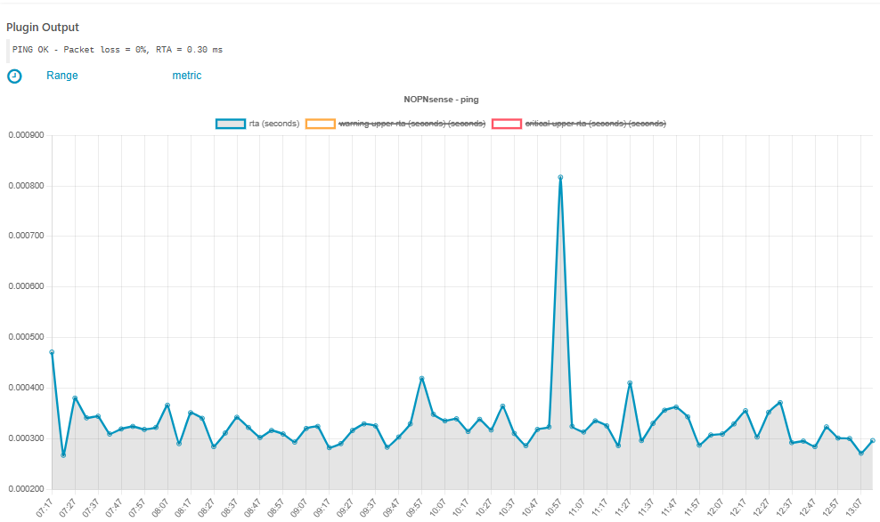

# About the Vislab Module 

This module provides an extendable interface for rendering timeseries based performance data.

Visualization is rendered using Chart.Js or gnuplot

Please read the following chapters for more insights on this module:

* [Installation](doc/02-Installation.md#module-vislab-installation)
* [Configuration](doc/03-Configuration.md#module-vislab-configuration)
* [Usage](doc/04-Usage.md#module-vislab-usage)

For convinience this module includes the following javascript libraries bundled with microbundle (MIT):
* chartjs (MIT)
* chartjs-plugin-zoom (MIT)
* hammer.js (MIT)
  
