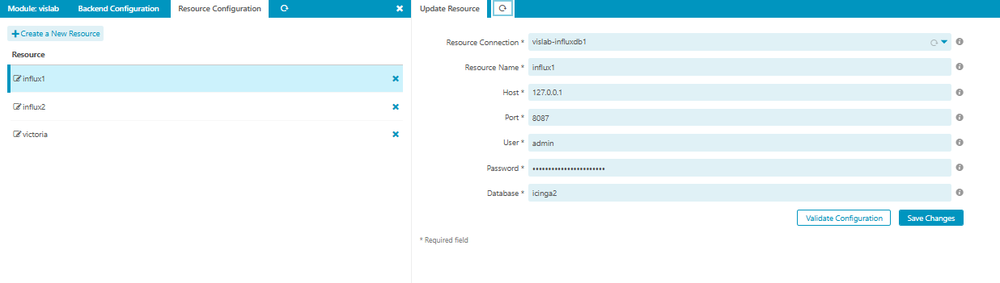

# Configuration 

## Ressource Configuration  

Currently, the following implementations are available:
* influxdb1
* influxdb2
* victoriametrics

you can provide your own implementations in your own module as log as you implement it as a 
`library/Vislab/Hook/ResourceConnectionHook.php`

## Module Configuration  

In the module configuration you can choose the resource name and the backend for dashboard rendering.

You can also show threshold by default and choose the gnuplot implementation.
