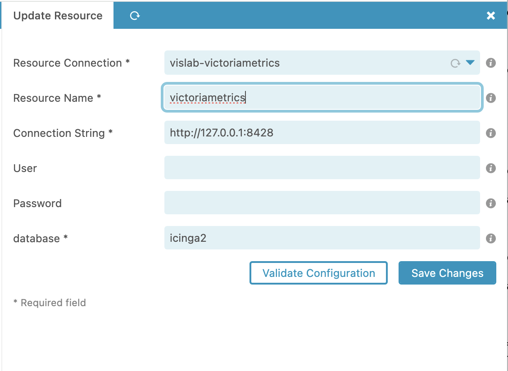

# Configuration <a id="module-vislab-configuration"></a>

## Ressource Configuration  <a id="module-vislab-configuration-module-ressource"></a>


Currently, the following implementations are available:
* influxdb1
* influxdb2
* victoriametrics

you can provide your own implementations in your own module as log as you implement it as a 
`library/Vislab/Hook/ResourceConnectionHook.php`

## Module Configuration  <a id="module-vislab-configuration-module"></a>


In the module configuration you can choose the resource name and the backend for dashboard rendering.

You can also show threshold by default and choose the gnuplot implementation.

## Datasource Configuration  <a id="module-vislab-configuration-datasource"></a>

For victoriametrics you can use the following in icinga2:

```
/**
 * The InfluxdbWriter type writes check result metrics and
 * performance data to an InfluxDB v1 HTTP API
 */

object InfluxdbWriter "victoriametrics" {
  host = "127.0.0.1"
  port = 8428
  database = "icinga2"
  flush_threshold = 1024
  flush_interval = 10s
  host_template = {
    measurement = "$host.check_command$"
    tags = {
      hostname = "$host.name$"
    }
  }
  service_template = {
    measurement = "$service.check_command$"
    tags = {
      hostname = "$host.name$"
      service = "$service.name$"
    }
  }
  enable_send_thresholds = true
  enable_send_metadata = true
}

```

and the corresponding configuration in vislab should look like that:

